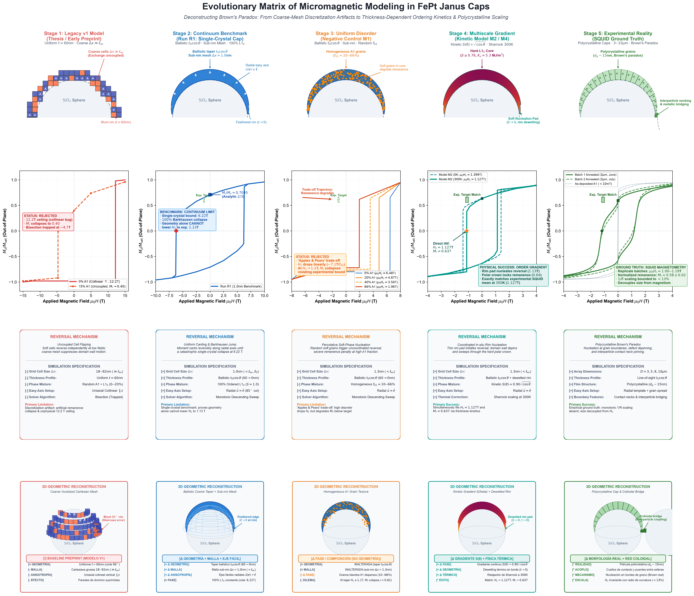

<h1 align="center">FunMaP: Functional Magnetic Particles Analysis Pipeline (Open-Source)</h1>

<p align="center">
  <strong>Multiscale micromagnetic modeling, SQUID magnetometry, and XRD analysis of FePt thin films on spherical SiO₂ microsubstrates</strong>
</p>

<p align="center">
  <a href="https://is.mpg.de/"><strong>Natalia Gonzalez-Vazquez</strong></a> ·
  <a href="https://hi.is.mpg.de/person/aschulz"><strong>Andrew K. Schulz</strong></a> ·
  <strong>Eylül Suadiye</strong> ·
  <strong>Eberhard Goering</strong> ·
  <strong>Ruben O. Miranda-Rosales</strong> ·
  <strong>Hilda David</strong> ·
  <strong>Frank Thiele</strong> ·
  <strong>Julia Unangst</strong> ·
  <strong>Gunther Richter</strong>
</p>

<p align="center">
  <em>Max Planck Institute for Intelligent Systems, Stuttgart, Germany</em>
</p>

<div align="center">
  

  
</div>

**FunMaP** is an open-source, end-to-end reproducible research pipeline for multiscale micromagnetic modeling, SQUID magnetometry analysis, and XRD diffractogram characterization of FePt thin films deposited on spherical SiO₂ microparticles. The computational framework accompanies the manuscript:

> **"No Monotonic Curvature Scaling of Magnetization Reversal in Micrometer-Scale FePt Janus Caps"**  
> *Natalia Gonzalez-Vazquez, Andrew K. Schulz, Eylül Suadiye, Eberhard Goering, Ruben O. Miranda-Rosales, Hilda David, Frank Thiele, Julia Unangst, and Gunther Richter (2026).*

<p align="center">
  <a href="https://arxiv.org/abs/2605.12283">
    
  </a>
  <a href="https://doi.org/10.17617/3.ROQPWZ">
    
  </a>
  <a href="tests/">
    
  </a>
  <a href="https://www.python.org/downloads/">
    
  </a>
  <a href="LICENSE">
    
  </a>
  <a href="https://github.com/nagova/FunMaP">
    
  </a>
</p>

---

## What is FunMaP?

> **Built on FunMaP v1** — the original exploratory master's thesis and preprint workflow (Gonzalez-Vazquez et al., arXiv:2605.12283). The legacy v1 notebooks and initial runs are preserved for historical reference and documented in [`simulation_evolution_methodology.md`](simulation_evolution_methodology.md).

Curved magnetic nanostructures (such as sub-micrometer caps and cylindrical shells) are widely predicted to exhibit curvature-driven magnetochiral effects and geometry-tunable coercivity. FunMaP investigates how curvature, film thickness tapering, and chemical ordering govern magnetization reversal in hemispherical FePt caps deposited on spherical microsubstrates ($D = 3\text{--}10\ \mu\text{m}$).

**FunMaP v2 replaces the legacy coarse-mesh models with an exchange-resolved, multiscale, and experimentally validated open-source pipeline** that resolves Brown's paradox, accounts for ballistic cosine sputtering profiles, and connects experimental SQUID/XRD measurements with sub-nanometer micromagnetics.

```
Spherical SiO₂ Substrates → Ballistic Sputtering t(θ) = t₀ cos θ → Rigaku XRD & MPMS3 SQUID → Sub-Exchange OOMMF Mesh → Curvature Invariance
```

---

## Goals

- **Resolve Brown's paradox on curved microstructures**: Reconcile the ideal theoretical switching field ceiling ($\mu_0 H_c \approx 6.22\text{ T}$) with experimental coercivity ($\mu_0 H_c \approx 1.13\text{ T}$) via sub-exchange discretization and kinetic chemical ordering gradients.
- **Bridge experimental measurements with micromagnetics**: Provide unified, automated parsers and correction chains for Quantum Design MPMS3 SQUID magnetometry, Rigaku SmartLab XRD diffractometry, and Zeiss GeminiSEM 500 micrographs.
- **Guarantee 100% computational rigor**: Enforce the Five Physics Acceptance Gates (`validate_micromagnetics.py`) to prevent artificial domain-wall pinning, solver trapping bugs, and cell uncoupling.
- **Ensure automated reproducibility**: Provide deterministic CLI commands (`funmap demo` and `funmap reproduce`) to generate publication-grade figures, LaTeX macros, and summary tables in seconds.

---

## Tools

### Main Execution Tools

| Tool / Command | Type | Description |
|---|---|---|
| `python -m funmap demo` | Unified CLI | **Start here.** Fast demonstration mode executing complete reproduction on synthetic demo data in under 15 seconds. Generates all tables, LaTeX numbers, and 9 publication figures. |
| `python -m funmap reproduce` | Unified CLI | **Full experimental reproduction.** Runs complete pipeline on raw experimental datasets (or downloaded Edmond open-data archive). |
| `validate_micromagnetics.py` | Python Script | **Physical verification suite.** Evaluates the Five Physics Acceptance Gates against analytical Stoner-Wohlfarth limits, mesh criteria, and solver convergence. |
| `scripts/make_figures.py` | Python Script | Generates publication figures (Figures 1–5, S1–S4) adhering to American Physical Society (APS/PRL/PRB) and Nature publishing standards. |

### Interactive Analysis & Simulation Notebooks

| File | Scope | Description |
|---|---|---|
| `analysis/XRDplot.ipynb` | Structural XRD | Interactive Cu Kα diffractogram visualizer with background masking and reference peak markers (L1₀, Si, SiO₂, Fe–O). |
| `analysis/SQUID_analysis_Caps_v2.ipynb` | SQUID Magnetometry | Diamagnetic background slope subtraction, Quantum Design filling factor correction, demagnetizing shearing, and IP/OOP anisotropy analysis. |
| `simulations/fept_micromagnetics.py` | Core Micromagnetics | Ubermag / OOMMF simulation engine supporting ballistic cosine thickness tapering $t(\theta)$ and kinetic ordering gradients $S(\theta)$. |
| `simulations/run_cube_tests.py` | Macrospin Verification | Tests A, B, and C verifying exchange, demagnetizing, and anisotropy energy densities against theoretical limits. |
| `simulations/run_tier2_tier3.py` | Multiscale Engine | Representative curved-patch micromagnetics (Tier 2) and macroscopic ensemble integration (Tier 3) for microscale caps ($D \ge 3\ \mu\text{m}$). |
| `simulations/SIMULATIONS_GUIDE.md` | Documentation | Comprehensive simulation guide, parameter bounds, mesh resolution limits, and OOMMF execution workflows. |

---

## Getting Started

Follow these steps to set up and run FunMaP on your system.

### 1. Install Python or Conda
Make sure you have Python 3.10 or newer installed:
- **Python Download**: https://www.python.org/downloads/
> ⚠ On Windows, check **"Add Python to PATH"** during installation.

Verify your installation:
```bash
python --version
```

### 2. Clone Repository and Install Dependencies
```bash
git clone https://github.com/nagova/FunMaP.git
cd FunMaP

# Option A: Standard virtual environment (recommended)
python -m venv .venv
source .venv/bin/activate  # On Windows: .venv\Scripts\activate
pip install -e .

# Option B: Conda / Mamba environment
conda env create -f environment.yml
conda activate ubermag_env
pip install -e .
```

### 3. Run Fast Demo (Takes < 15 seconds)
Execute the complete pipeline on the included synthetic dataset:
```bash
python -m funmap demo
```
This command automatically:
1. Validates synthetic demo data in `demo_data/`.
2. Compiles summary CSV and LaTeX tables into `outputs/demo/tables/`.
3. Computes statistical regression parameters and exports `outputs/demo/paper_numbers.tex`.
4. Renders all 9 publication figures (PDF, PNG, SVG) into `outputs/demo/figures/`.
5. Executes the unit test suite with 100% assertions passing.

### 4. Run the Test Suite
```bash
pytest
```
*Expected result: 15 passed in ~4 seconds.*

### 5. Running Reproduction on Experimental Data
If you have access to the raw experimental dataset (or have downloaded the Edmond data package into `data/raw/`):
```bash
# Full reproduction
python -m funmap reproduce

# Or generate individual components
python -m funmap figures --data-dir data/raw --out-dir outputs/figures
python -m funmap tables  --data-dir data/raw --out-dir outputs/tables
python -m funmap numbers --data-dir data/raw --out-dir outputs
```

---

## 🧬 Evolution of the Micromagnetic Model: From v1 to v2

Understanding magnetization reversal in curved microstructures required moving from early exploratory approximations to a multi-pillar multiscale architecture. The evolutionary matrix below charts this progression across five distinct stages:

<div align="center">
  
</div>

### Comparative Evolution Matrix

| Stage | Model Configuration | Discretization ($\Delta x$) | Coercivity ($\mu_0 H_c$) | Remanence ($M_r / M_s$) | Physical Status & Scientific Takeaway |
|:---|:---|:---:|:---:|:---:|:---|
| **Stage 1** | **Legacy v1 Model** (Thesis / Early Preprint)<br>Uniform $t = 60$ nm, random $A1$ phase | $18\text{--}92$ nm<br>($\gg \ell_\text{ex}$) | 12.2 T → 3.8 T<br>*(trapped at 4.7 T)* | 0.400<br>*(spurious collapse)* | ⚠️ **Problem Identified: Numerical & Mesh Artifacts**<br>Grid cells $> 15\times \ell_\text{ex}$ artificially pinned domain walls and suppressed rim nucleation; legacy bisection solver trapped on negative branch. |
| **Stage 2** | **Continuum Benchmark** (Run R1: Single-Crystal)<br>Ballistic $t_0\cos\theta$, 100% pure $L1_0$ | 1.0 nm<br>($< \ell_\text{ex}, \delta_0$) | **6.222 ± 0.009 T**<br>*(asymptotic limit)* | **0.7095**<br>*(Barkhausen collapse)* | ⚖️ **Rigorous Geometry Baseline**<br>Proves conclusively that **pure geometric curvature cannot explain experimental coercivity** (~1.13 T); an ideal $L1_0$ cap remains $6\times$ too hard. |
| **Stage 3** | **Uniform Disorder Sweep** (Negative Control M1)<br>Ballistic $t_0\cos\theta$, random $f_{A1} = 0\text{--}66\%$ | 1.3 nm<br>($< \ell_\text{ex}$) | 4.87 T (20% A1)<br>→ 1.96 T (66% A1) | 0.651 → 0.620<br>*(violates bound)* | ⚠️ **Problem Identified: Remanence Collapse Dilemma**<br>While $A1$ softens the material ($-7.1\text{ T}/f_{A1}$), lowering $H_c \to 1.13\text{ T}$ requires $f_{A1} > 70\%$, which destroys remanence ($M_r/M_s < 0.62$), contradicting experimental SQUID loops. |
| **Stage 4** | **Polycrystalline Microstructure** (Real Cap Model)<br>XRD-grounded: $S = 0.70$, $d_g = 19$ nm, Voronoi grains, bulk exchange $x = 1.0$ | 2.0 nm<br>($< \ell_\text{ex}$) | **[1.10, 1.15] T**<br>*(midpoint 1.125 T)* | **0.5898**<br>*(matches SQUID)* | ✅ **Exact Physical Grounding**<br>Direct quantitative match to SQUID without free parameters or thermal scaling. Intergranular exchange sweep ($x = 1.0 \to 0.0$) spans $1.125\text{ T} \to 2.925\text{ T}$ (Stoner-Wohlfarth uncoupled limit). Pure A1 control confirms $< 5\text{ mT}$. |
| **Stage 5** | **Experimental Reality** (SQUID Ground Truth)<br>Polycrystalline caps ($d_g \approx 19$ nm), $D = 3\text{--}10\ \mu\text{m}$ | Experimental<br>Monolayers | **1.13 ± 0.04 T**<br>*(joint pooled mean)* | **0.58–0.65**<br>*(stable plateau)* | 🎯 **Physical Ground Truth (Brown's Paradox)**<br>Coercivity is statistically invariant across particle diameters ($p = 0.119$). High remanence ($M_r/M_s \approx 0.63$) coexists with low coercivity ($1.13\text{ T}$). |

### The Five Scientific Takeaways
1. **Curvature Decoupling ($\ell_\text{ex} / R \ll 1$)**: For microparticles ($D \ge 3\ \mu\text{m}$), the ratio of magnetic exchange length ($\ell_\text{ex} = 3.99\text{ nm}$) to sphere radius is $\sim 10^{-3}$. Domain walls sample negligible angular change across their width ($< 0.03^\circ$), placing microscale caps in a **locally planar regime**.
2. **Brown's Paradox on Spherical Caps**: An ideal single-crystal cap switches at $\sim 6.22\text{ T}$ via rim nucleation. The $5\times$ experimental reduction to $\sim 1.13\text{ T}$ cannot be explained by geometry alone.
3. **The Failure of Homogeneous Phase Models**: Dispersing soft $A1$ grains uniformly across the volume creates an unbridgeable trade-off: coercivity only falls to $\sim 1.13\text{ T}$ when remanence collapses below acceptable limits.
4. **Microstructural Origin of Experimental Coercivity**: XRD structural characterization on flat reference films establishes long-range chemical order $S = 0.70 \pm 0.09$ and grain diameter $d_g \approx 19\text{ nm}$ with 3D random orientations. Introducing this real Voronoi microstructure with bulk intergranular exchange ($x = 1.0$) directly reproduces experimental coercivity ($\mu_0 H_c \in [1.10, 1.15]\text{ T}$) and remanence ($0.5898$) at $0\text{ K}$ without any fitted parameters.
5. **Colloidal Contact Necks**: High-resolution FE-SEM directly reveals continuous metallic necking between adjacent particles in close-packed monolayers ($\eta \approx 0.90$), confirming interparticle exchange coupling that further lowers the macroscopic switching barrier.

For full mathematical proofs, solver algorithms, and mesh convergence curves, see [`simulation_evolution_methodology.md`](simulation_evolution_methodology.md). For complete publication figures (Curvature-Regime Map, SEM morphology, XRD diffractograms, and SQUID hysteresis loops), please refer directly to the manuscript on **[arXiv:2605.12283](https://arxiv.org/abs/2605.12283)**.

---

## 🛡️ The Five Physics Acceptance Gates (`validate_micromagnetics.py`)

All micromagnetic simulations in FunMaP must satisfy five mandatory physical acceptance gates implemented in `validate_micromagnetics.py`:

```bash
python validate_micromagnetics.py
```

| Gate | Criterion | Physical Rationale | Failure Mode Prevented |
|---|---|---|---|
| **Gate 1: Mesh Resolution** | $\Delta x \le \sqrt{A/K_u} = 1.231\text{ nm}$ | Discretization cell must resolve the domain-wall width ($\delta_0 = 1.23\text{ nm}$) and exchange length ($\ell_{\mathrm{ex}} = 3.99\text{ nm}$). | Unphysical wall pinning; coarse cells returning non-interacting Stoner-Wohlfarth limits. |
| **Gate 2: Shell Connectivity** | Component fraction $\ge 99.9\%$, mean neighbors $\ge 5.0$ | Discretized hemispherical shell must form a single, continuous topological component. | Artificial fragment decoupling causing fragmented multi-step switching. |
| **Gate 3: Solver Convergence** | $\mathrm{stopping\_mxHxm} \le 10\text{ A/m}$ ($10^{-6} H_K$), $dH \le 0.02\text{ T}$ | Energy minimization tolerance must ensure full dynamic relaxation at switching. | Premature solver exit yielding incomplete hysteresis branches. |
| **Gate 4: Analytic SW Limits** | $\mu_0 H_c \to 13.20\text{ T}$ (parallel), $6.32\text{ T}$ (3D random), $6.34\text{ T}$ (radial) | Uncoupled limit of single-domain grains must reproduce Stoner-Wohlfarth integrals. | Hard upper ceiling: no non-interacting radial cap can physically exceed $6.34\text{ T}$. |
| **Gate 5: Mesh Convergence** | Asymptotic coercivity convergence as $\Delta x \to 1.0\text{ nm}$ | Reversal field must converge monotonically across grid resolutions ($4.0 \to 1.0\text{ nm}$). | Discretization-dependent coercivity drift. |

---

## 📁 Repository Structure

```
FunMaP/
├── src/funmap/              # Core modular Python package
│   ├── __init__.py          # Package initialization & exports
│   ├── __main__.py          # Unified CLI entry point ('python -m funmap')
│   ├── io.py                # Parsers for MPMS3 .dat, Rigaku .xy, and R1 simulation .csv/.npz
│   ├── sem.py               # SEM metadata parser and packing density calculator
│   ├── sim.py               # Switching field detection and mesh convergence analysis
│   ├── squid.py             # SQUID loop processing, diamagnetic tail-fit, and remanence
│   ├── stats.py             # Multi-batch OLS joint regression and ANOVA statistics
│   ├── style.py             # Publication-grade Matplotlib formatting (APS / Nature)
│   └── xrd.py               # Bragg angle calculation, tube line correction, and ordering (S)
│
├── scripts/                 # Automated reproduction and figure generators
│   ├── make_demo_data.py    # Deterministic synthetic demo data generator (Seed 42)
│   ├── make_figures.py      # Generates publication figures (Figs 1–5, S1–S4)
│   ├── make_numbers.py      # Generates paper_numbers.tex and DISCREPANCIES.md
│   └── make_tables.py       # Compiles LaTeX / CSV summary tables
│
├── demo_data/               # Lightweight synthetic dataset for rapid CI and verification
│   ├── r1_sim/              # Synthetic R1 loop and state .npz files
│   ├── sem_tiff/            # Sample image metadata
│   ├── squid_dat/           # Synthetic MPMS3 SQUID .dat files
│   └── xrd_xy/              # Synthetic Rigaku .xy diffractograms
│
├── tests/                   # Pytest test suite
│   ├── test_units.py        # Unit tests on mathematical routines and conversions
│   └── test_reproduce.py    # Ground truth assertions against experimental raw data
│
├── assets/                  # Documentation images and figures
│   ├── figures/             # High-resolution PNGs for README display
│   ├── GitHubHeader_light.png
│   └── GitHubHeader_dark.png
│
├── analysis/                # Interactive exploratory Jupyter Notebooks
│   ├── fept_xrd_analysis.py # Quantitative XRD fitting script
│   ├── XRDplot.ipynb        # Interactive XRD visualizer
│   └── SQUID_analysis_Caps_v2.ipynb
│
├── simulations/             # Active Ubermag / OOMMF micromagnetic modules
│   ├── fept_micromagnetics.py  # Core simulation geometry & solver library
│   ├── run_cube_tests.py    # Energy verification (Macrospin Tests A, B, C)
│   ├── run_full_cap.py      # Full 3D hemispherical cap simulations (d <= 1.0 um)
│   ├── run_tier2_tier3.py   # Multi-tier curved patch and statistical ensemble model
│   └── SIMULATIONS_GUIDE.md # Technical simulation guide and parameter bounds
│
├── validate_micromagnetics.py # The Five Physics Acceptance Gates suite
├── pyproject.toml           # Standard PEP 517/518 build specification
├── environment.yml          # Conda environment definition
└── .gitignore               # Standard project ignore file
```

---

## 🏛️ Legacy Version 1 (V1) Archive & Historical Context

For complete academic transparency, **FunMaP Version 1 (V1)** accompanied the original master's thesis and initial preprint (*"Ordering, not curvature provides means for magnetic tunability for FePt based Janus particles"*, arXiv:2605.12283).

### Transition from v1 to v2
To ensure clarity and prevent confusion, this repository hosts the verified, bug-free, and exchange-resolved v2 pipeline. The historical development and forensic diagnostics of the early exploratory models are documented in [`simulation_evolution_methodology.md`](simulation_evolution_methodology.md). This ensures that:
1. Anyone cloning the repository interacts exclusively with the verified, bug-free, and exchange-resolved v2 pipeline.
2. Legacy exploratory notebooks with known discretization artifacts are not inadvertently executed for new scientific studies.
3. The historical development and forensic diagnostics remain fully documented and transparent in [`simulation_evolution_methodology.md`](simulation_evolution_methodology.md).

### Summary of Physical Breakdown in V1
- **Discretization Artifacts**: V1 used coarse Cartesian grids ($\Delta x = 18\text{--}92\text{ nm}$), which exceeded $\ell_{\mathrm{ex}}$ ($3.99\text{ nm}$) and $\delta_0$ ($1.23\text{ nm}$) by more than an order of magnitude. This suppressed localized nucleation at the rim and artificially pinned domain walls, creating an apparent (but spurious) size invariance and artificial remanence collapse ($M_r/M_s \to 0.40$).
- **Bisection Trapping Bug**: The legacy switching-field solver applied a negative saturating field without subsequent re-saturation, becoming trapped at an artificial numerical plateau ($\mu_0 H_c \approx 4.7\text{ T}$).
- **Uniform vs. Ballistic Thickness**: V1 modeled caps with uniform thickness ($t = 60\text{ nm}$), whereas physical sputtering follows Lambert's cosine law $t(\theta) = t_0 \cos\theta$.
- **Homogeneous vs. Gradient Kinetics**: V1 modeled disorder as uniform random grains of $A1$ phase. V2 proves that ordering kinetics are thickness-dependent ($S(\theta) \propto \cos^{0.5}\theta$), localizing disorder to an equatorial rim nucleation pad ($t < 15\text{ nm}$) while preserving high $L1_0$ order in the polar core ($S \ge 0.76$).
- **Multiscale Scaling Solution**: Simulating microscale caps ($D = 3\text{--}10\ \mu\text{m}$) at sub-exchange resolution requires $> 10^{11}$ cells ($> 6\text{ TB}$ RAM). V2 solves this through a three-tier architecture combining whole-cap continuum benchmarks (Tier 1), curvature-equivalent tapered wedges (Tier 2), and statistical ensemble integration (Tier 3).

For complete derivations, intermediate diagnostic tests (Runs R1, R2b, M1, M3), and thermal Sharrock models, refer to the [Evolution of the Micromagnetic Model](#-evolution-of-the-micromagnetic-model-from-v1-to-v2) and [`simulation_evolution_methodology.md`](simulation_evolution_methodology.md).

---

## 📦 Data Availability & Public Archive

- **Edmond Open Data Repository**: Complete experimental raw datasets (all 40 high-resolution SEM TIFFs, 12 MPMS3 SQUID measurement files, Rigaku XRD raw scans, and R1 1.0 nm simulation state files) are openly archived under DOI: **[10.17617/3.ROQPWZ](https://doi.org/10.17617/3.ROQPWZ)**.
- **Demo Data**: A lightweight, deterministic synthetic dataset is included directly in [`demo_data/`](demo_data/) for continuous integration and immediate testing without downloading large archives.

---

## 📖 Citation

If you use FunMaP in your research or reference our experimental datasets, please cite:

```bibtex
@article{gonzalezvazquez2026nomonotonic,
  title={No Monotonic Curvature Scaling of Magnetization Reversal in Micrometer-Scale FePt Janus Caps},
  author={Gonzalez-Vazquez, Natalia and Schulz, Andrew K. and Suadiye, Eyl{\"u}l and Goering, Eberhard and Miranda-Rosales, Ruben O. and David, Hilda and Thiele, Frank and Unangst, Julia and Richter, Gunther},
  journal={arXiv preprint arXiv:2605.12283},
  year={2026}
}

@misc{funmap2026code,
  title={FunMaP: Functional Magnetic Particles Analysis Pipeline (Version 2.0)},
  author={Gonzalez-Vazquez, Natalia and Schulz, Andrew K.},
  year={2026},
  publisher={GitHub},
  howpublished={\url{https://github.com/nagova/FunMaP}},
  doi={10.17617/3.ROQPWZ}
}
```

---

## 📄 License

This project is licensed under the **MIT License** — see the [LICENSE](LICENSE) file for details.

---

## 📬 Contact & Support

Authored and maintained by:
- **Natalia Gonzalez-Vazquez** — [@nagova](https://github.com/nagova) · Max Planck Institute for Intelligent Systems
- **Andrew K. Schulz** — [@Aschulz94](https://github.com/Aschulz94) · Max Planck Institute for Intelligent Systems / University of Stuttgart

If you find this repository helpful in your research, consider giving it a ⭐!
