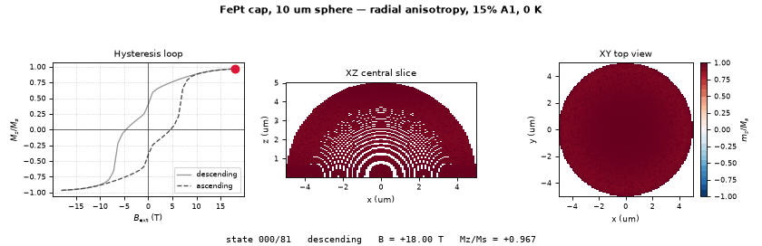
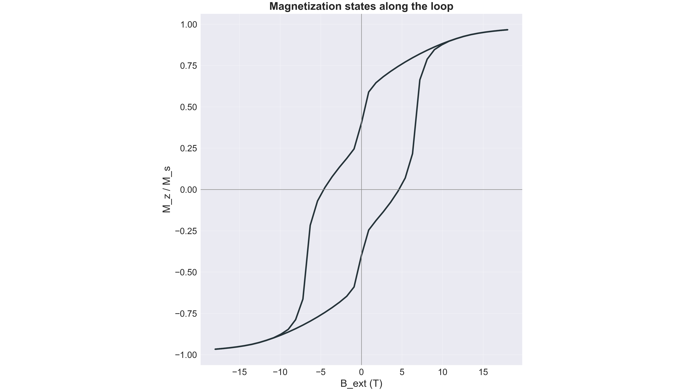

# Example Results

Example outputs from the FunMaP pipeline, included so the repository shows what the
notebooks actually produce without requiring anyone to re-run a simulation.

These files accompany the preprint:

> **Ordering, not curvature, provides means for magnetic tunability for FePt based Janus particles**
> Natalia Gonzalez-Vazquez, Eylül Suadiye, Eberhard Goering, Ruben O. Miranda-Rosales,
> Hilda David, Frank Thiele, Julia Unangst, Andrew K. Schulz, Gunther Richter
> arXiv preprint: [arXiv:2605.12283](https://arxiv.org/abs/2605.12283)

Full datasets are archived separately on Edmond: [10.17617/3.ROQPWZ](https://doi.org/10.17617/3.ROQPWZ)

---

## `snapshot_10um_radial_15pctA1/`

Real spatial magnetization states along a full hysteresis loop for a single FePt cap,
produced by [`simulations/FePt_real_magnetization_snapshots.ipynb`](../simulations/FePt_real_magnetization_snapshots.ipynb).

### Simulation parameters

| Parameter | Value |
|---|---|
| Sphere diameter | 10 µm |
| Cap thickness | 60 nm |
| Anisotropy mode | Radial (easy axis along the local surface normal) |
| Soft A1 fraction | 15% |
| Temperature | 0 K (`MinDriver`) |
| Field sweep | ±18 T, 41 points per branch |
| Saved states | 82 (41 descending + 41 ascending) |
| Solver | Ubermag / OOMMF |

### Animation



All 82 states in sequence. Left: the hysteresis loop with a marker at the current field.
Centre: the XZ central slice through the cap (a slice near `y = 0`, not a projection).
Right: the XY top view. Colour is `m_z / M_s`; white pixels are outside the magnetic
FePt shell.

### Summary figure



### Contents

| File | Description |
|---|---|
| `snapshot_animation.gif` | Loop animation over all 82 saved states |
| `snapshot_summary.png` / `.svg` | Static multi-state summary figure |
| `hysteresis.csv` | `B_ext` and `Mz/Ms` for the loop |
| `snapshot_manifest.csv` | Full 82-state index: field, averaged magnetization, and source file per state |
| `states/*.npz` | Seven representative spatial states (see below) |

### Included states

The manifest lists all 82 states, but only these seven `.npz` files are committed, to keep
the repository small. They are the physically interesting landmarks:

| File | Field | `Mz/Ms` | Meaning |
|---|---|---|---|
| `state_000_descending_state_B+18.000T.npz` | +18.0 T | +0.967 | Positive saturation |
| `state_020_descending_state_B+0.000T.npz` | 0.0 T | +0.400 | Descending remanence |
| `state_025_descending_state_B-4.500T.npz` | −4.5 T | +0.011 | Descending coercivity |
| `state_040_descending_state_B-18.000T.npz` | −18.0 T | −0.967 | Negative saturation |
| `state_061_ascending_state_B+0.000T.npz` | 0.0 T | −0.400 | Ascending remanence |
| `state_066_ascending_state_B+4.500T.npz` | +4.5 T | −0.011 | Ascending coercivity |
| `state_081_ascending_state_B+18.000T.npz` | +18.0 T | +0.967 | Back to positive saturation |

Note that remanence is only `|Mz/Ms| = 0.40`, well below 1. That is the curvature at work:
with radial anisotropy the easy axis follows the local surface normal, so at zero field the
moments fan outward with the cap rather than staying aligned with `z`.

### `.npz` contents

Each state file holds:

| Key | Shape | Description |
|---|---|---|
| `mz_over_Ms` | (110, 110) | XZ central-slice map of `m_z / M_s`; `NaN` outside the shell |
| `xy_mz_over_Ms` | (110, 110) | XY top-view map |
| `x_um`, `y_um`, `z_um` | (110,) | Axis coordinates in µm |
| `B_ext_T` | scalar | Applied field |
| `Mz_over_Ms` | scalar | Volume-averaged magnetization |
| `step_index`, `label`, `branch` | scalar | Position along the loop |

Load one with:

```python
import numpy as np
z = np.load("states/state_020_descending_state_B+0.000T.npz", allow_pickle=True)
print(z["B_ext_T"], z["Mz_over_Ms"])
```

---

## What is not here

The complete run is far too large for version control and is deliberately excluded by
`.gitignore`:

- the raw OOMMF drive directories (~9.8 GB of `.omf` / `.odt` files)
- all 82 `.npz` state files (~11 MB)
- `interactive_snapshot_viewer.html` (~27 MB, and it loads Plotly from a CDN, so GitHub
  will not render it anyway)

The interactive viewer can be rebuilt from any folder of saved `state_*.npz` files using the
folder-based cell in `FePt_real_magnetization_snapshots.ipynb`. See
[`simulations/SIMULATIONS_GUIDE.md`](../simulations/SIMULATIONS_GUIDE.md) for the full workflow.

---

## Citation

If you use these results, please cite the preprint above and the repository:

```bibtex
@misc{gonzalezvazquez_funmap_2026,
  title  = {FunMaP: Customizable simulations for Janus particles' magnetic properties
            with associated visualizations},
  author = {Gonzalez-Vazquez, Natalia and Schulz, Andrew K.},
  year   = {2026},
  note   = {In preparation},
}
```
